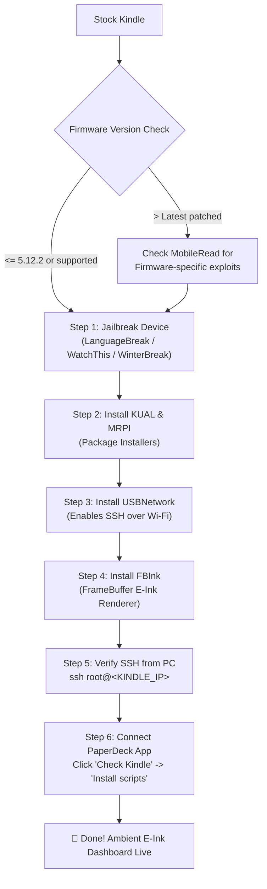

# Kindle Setup & Installation Guide 📟

This guide explains everything required to prepare your Amazon Kindle as a dedicated, high-contrast e-ink smart workstation dashboard with **PaperDeck**.

---

## 🗺️ Visual Setup Flowchart



---

## 📱 Hardware Compatibility Matrix

PaperDeck works on any jailbroken Kindle capable of running **FBInk** and an **Upstart** or system daemon:

| Device Model | Generation | Native Resolution | Status |
| --- | --- | --- | --- |
| **Kindle Touch (KT / KT2 / KT3)** | 7th / 8th Gen | 800x600 (167 PPI) | ✅ Fully Supported (Base Target) |
| **Kindle Paperwhite 2 / 3** | 6th / 7th Gen | 1024x758 / 1448x1072 | ✅ Fully Supported |
| **Kindle Paperwhite 4 (PW4)** | 10th Gen | 1448x1072 (300 PPI) | ✅ Fully Supported |
| **Kindle Paperwhite 5 (PW5)** | 11th Gen (6.8") | 1648x1236 (300 PPI) | ✅ Fully Supported |
| **Kindle Voyage / Oasis (1/2/3)** | Any Gen | 1448x1072 / 1680x1264 | ✅ Fully Supported |
| **Kindle Basic (10th / 11th Gen)** | 2019 / 2022 | 800x600 / 1448x1072 | ✅ Fully Supported |

---

## 🛠️ Step 1: Jailbreak Your Kindle

Your Kindle must be jailbroken to allow running background display scripts and SSH.

### Finding Your Firmware Version
On your Kindle:
1. Tap **Settings** (gear icon) -> **All Settings**.
2. Tap **Device Options** -> **Device Info**.
3. Note your **Firmware Version** (e.g. `5.12.2`, `5.13.4`, `5.16.2`).

### Jailbreak Exploits by Firmware:
- **Firmware `<= 5.16.2.1.1`**: [LanguageBreak](https://www.mobileread.com/forums/showthread.php?t=356608) — Most modern software exploit using language selection.
- **Firmware `<= 5.14.2`**: [WatchThis](https://www.mobileread.com/forums/showthread.php?t=346784) — Exploit using demo mode.
- **Firmware `<= 5.13.3`**: [WinterBreak / KindleBreak](https://www.mobileread.com/forums/showthread.php?t=338268).
- **Master Jailbreak Index**: Check the official [MobileRead Jailbreak Matrix](https://wiki.mobileread.com/wiki/Kindle_Hacking#Jailbreak_Matrix) for the latest community methods.

> ⚠️ **Important:** Once jailbroken, install the **JailBreak Hotfix** from MobileRead to prevent Amazon OTA updates from removing root access.

---

## 📦 Step 2: Install KUAL and MRPI

1. **MobileRead Package Installer (MRPI)**:
   - Download the latest MRPI release from the [NiLuJe's Kindle Hacks thread](https://www.mobileread.com/forums/showthread.php?t=225030).
   - Unpack and copy the `extensions` and `mrpackages` folders to the root of your Kindle (`/mnt/us/`).
2. **KUAL (Kindle Unified Application Launcher)**:
   - Download the `KUAL-coplate` booklet package.
   - Copy the booklet to `/mnt/us/extensions/` or install via MRPI.
   - You should now see a **KUAL** book/document in your Kindle library.

---

## 🔌 Step 3: Install USBNetwork (SSH)

USBNetwork provides an SSH server (`dropbear`) allowing your computer to communicate with the Kindle over Wi-Fi or USB.

1. Download the latest `kindle-usbnetwork-*.tar.xz` package from [NiLuJe's snapshots](https://www.mobileread.com/forums/showthread.php?t=225030).
2. Extract and copy the `.bin` update file into `/mnt/us/mrpackages/`.
3. On your Kindle, open **KUAL**, tap **Helper+**, then tap **Install MRPI Packages**.
4. Configure USBNetwork for Wi-Fi:
   - Connect the Kindle to your computer via USB.
   - Open `/mnt/us/usbnet/config`.
   - Change `KUAL_ENABLE_WIFI="true"` to allow SSH over local Wi-Fi.
5. Set Root Password:
   - Connect via USB or terminal.
   - Set a password for user `root` (or configure SSH public keys in `/mnt/us/usbnet/etc/authorized_keys`).

---

## 🎨 Step 4: Install FBInk

**FBInk** (FrameBuffer Ink) is the library that draws images directly to the Kindle e-ink display controller without launching full graphical apps.

1. Download the pre-built `FBInk` binary from [NiLuJe's FBInk GitHub Repository](https://github.com/NiLuJe/FBInk/releases) or the MobileRead tools thread.
2. Extract the binary and place it in:
   ```text
   /usr/bin/fbink
   ```
   *(or `/mnt/us/bin/fbink`)*
3. Test that FBInk works by running via SSH:
   ```bash
   fbink -c -m -q "PaperDeck Ready"
   ```
   You should immediately see "PaperDeck Ready" rendered on your Kindle screen!

---

## 💻 Step 5: Connecting PaperDeck from Your PC / Mac

Now that your Kindle is jailbroken and has SSH and FBInk installed:

```
┌─────────────────────────────────┐           ┌─────────────────────────────────┐
│        Computer (Host)          │           │         Kindle (Client)         │
│                                 │           │                                 │
│  1. Open PaperDeck              │           │                                 │
│  2. Go to Kindle > Settings     │  SSH (22) │                                 │
│  3. Enter Kindle IP & Password  ├──────────►│  Validates FBInk, Upstart, PATH │
│  4. Click "Check Kindle"        │◄──────────┤  Returns OK status              │
│                                 │           │                                 │
│  5. Click "Install Scripts"     ├──────────►│  Copies /mnt/us/dash-loop.sh    │
│                                 │           │  Registers /etc/upstart daemon  │
│                                 │           │                                 │
│  Local Server: :8787/dash.png   │◄──────────┤  Curl loop downloads image      │
│  Renders 800x600 every N sec    │           │  FBInk draws to screen          │
└─────────────────────────────────┘           └─────────────────────────────────┘
```

1. Open the **PaperDeck** desktop application.
2. Navigate to **Kindle > Configuration**.
3. Fill in:
   - **Kindle IP**: The local Wi-Fi IP of your Kindle (found in Kindle Settings -> Wi-Fi -> tap connected network).
   - **SSH Port**: `22`
   - **SSH User**: `root`
   - **SSH Password**: The password you set during USBNetwork setup.
   - **Kindle Download**: `180` (seconds between refreshes; 3 minutes is recommended).
   - **Full Refresh**: `20` (cycles between anti-ghosting full screen refreshes).
4. Click **Save**.
5. Switch to **Kindle > Diagnostics and Installation**:
   - Click **Check Kindle**: PaperDeck verifies SSH access, root permissions, FBInk, and Upstart daemons.
   - Click **Install scripts**: PaperDeck automatically uploads `dash-loop.sh` and registers the startup service.
6. Click **Start script**. Your Kindle will immediately fetch and display your live workstation dashboard!

---

## 🔋 Battery Life & Deep Sleep (RTC)

PaperDeck includes intelligent battery preservation built into `dash-loop.sh`:

- **Night Standby**: The script automatically puts the Kindle into RTC deep sleep during configurable hours (default: **01:00 AM to 10:00 AM**).
- **Wi-Fi Suspend**: Wi-Fi is powered off while waiting between render intervals and gracefully reconnected before downloading the next frame.
- **Battery Expectation**: With a 3-minute refresh interval and 9 hours of night sleep, a standard Kindle battery lasts **2 to 3 weeks** on a single charge.

---

## ❓ Troubleshooting

| Issue | Solution |
| --- | --- |
| **SSH Connection Refused** | Ensure USBNetwork is set to Wi-Fi mode (`KUAL_ENABLE_WIFI="true"` in `/mnt/us/usbnet/config`) and restart the Kindle. |
| **FBInk: Command Not Found** | Verify that `fbink` is executable (`chmod +x /usr/bin/fbink`) and located in `/usr/bin/fbink` or in `$PATH`. |
| **Image Not Updating** | Verify your computer's firewall allows incoming connections on port `8787`. You can test reachability from another device: `http://<HOST_IP>:8787/api/ping`. |
| **Screen Ghosting** | Increase the frequency of full refreshes in **Kindle > Configuration** (e.g. set Full Refresh to `10` or `15` cycles). |
| **Host IP Changed** | The Kindle daemon auto-discovers your computer via mDNS (`paperdeck.local`) and subnet scanning. If you change networks, you can re-save your settings in the PaperDeck UI. |
