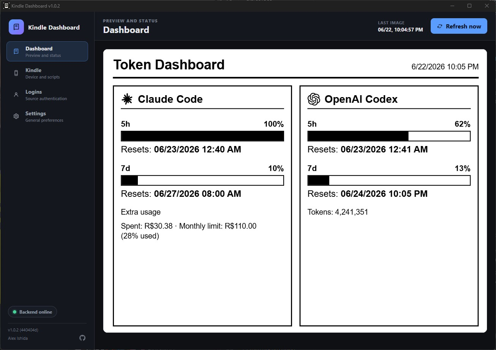
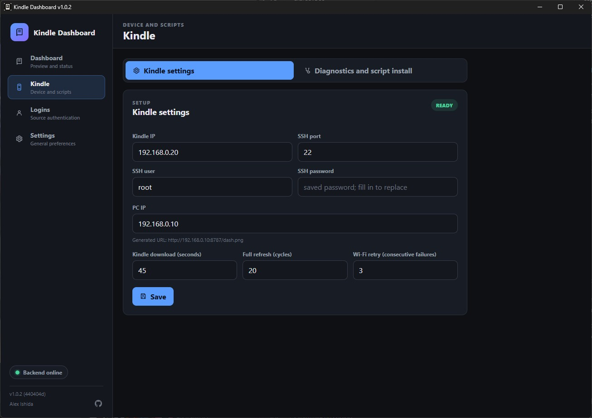
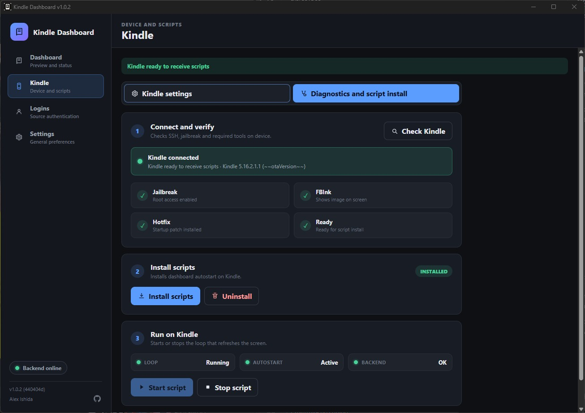
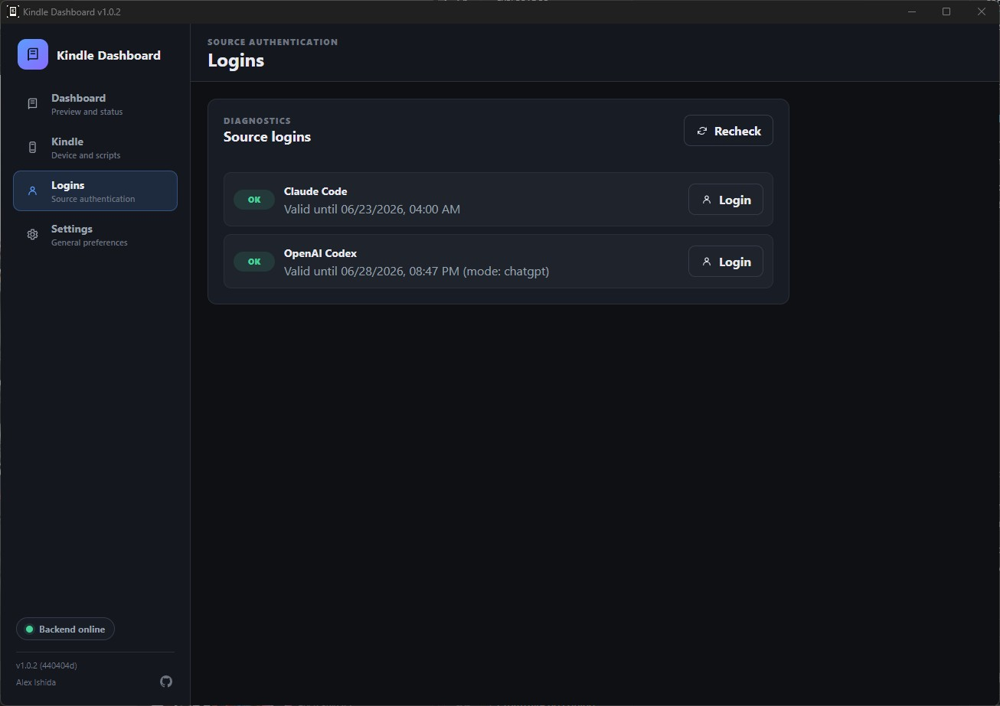
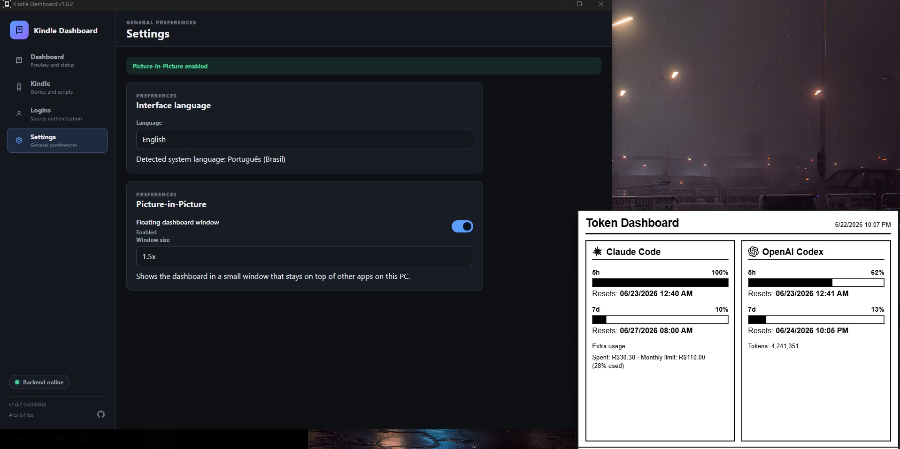
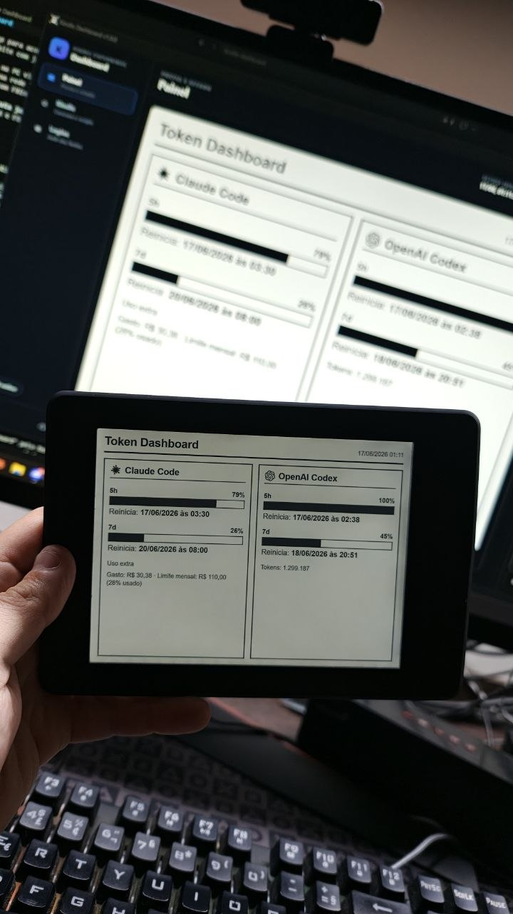

<p align="center">
  <a href="README.md"><b>English</b></a> •
  <a href="README.pt.md"><b>Português</b></a> •
  <a href="README.es.md"><b>Español</b></a>
</p>

# PaperDeck 📟

<p align="center">
  <a href="https://hacktoberfest.com/"></a>
  <a href="LICENSE"></a>
  <a href="https://nodejs.org/"></a>
  <a href="https://www.typescriptlang.org/"></a>
  <a href="https://react.dev/"></a>
  <a href="https://www.electronjs.org/"></a>
  
</p>

> **Turn your jailbroken Kindle into a dedicated, ambient e-ink smart workstation & companion dashboard.** Created by **Lucas Rafaldini**.

PaperDeck runs an ambient background server on your host computer (macOS, Windows, or Linux) that gathers local metrics from your active developer agents (Claude Code, Antigravity, OpenCode, Codex), machine health, media playback, and custom websites. It captures an 800x600 high-contrast monochrome canvas and serves it over HTTP to your Kindle, which draws it using FBInk.

---

## 📸 Screenshots

| Desktop Control Panel | Kindle Configuration |
| :---: | :---: |
|  |  |

| Diagnostics & Script Installer | Logins & Authentication |
| :---: | :---: |
|  |  |

| Desktop Picture-in-Picture (PiP) | Live on Physical Kindle |
| :---: | :---: |
|  |  |

---

## ✨ Features

- 📐 **Visual Drag-and-Drop Layout Editor**: Real-time grid builder to arrange, resize, and customize cards.
- 🤖 **AI & Agent Quotas**:
  - **Claude Code**: Live 5-hour limit, 7-day token quota, reset timers, and 7-day trend graph.
  - **Antigravity AI**: 5-hour bar, weekly quota, session step counters, and active model badge.
  - **OpenCode**: Agent run status, active model, session counters, and token analytics.
  - **OpenAI Codex**: Live token limits and rollout history (supports native WSL scanning).
- 👾 **Memtchi Virtual Pet (Tamagotchi)**:
  - Interactive pixel-art desk companion living on your e-ink screen.
  - Hunger, happiness, and energy management.
  - Actions: Feed, Play, Clean, Sleep, and humorous developer reactions.
- 🖥️ **System Health & Hardware**:
  - Live CPU load %, RAM usage (GB / %), disk capacity, uptime, and system model.
- 🎵 **Media & Connected Services**:
  - **Apple Music**: Track title, artist, album, and live playback progress timeline.
  - **OmniRouter**: AI gateway tokens and upstream latency metrics.
  - **Chaos Machine**: Remote Linux server status and health checks.
  - **Site Scraper / RSS**: Headlines monitor for blogs, news, and releases.
- 🔋 **Battery Optimization & RTC Deep Sleep**:
  - Automated night sleep (01:00 AM – 10:00 AM) and Wi-Fi duty cycling (lasts 2 to 3 weeks on one charge).
  - Dynamic host auto-discovery via mDNS (`paperdeck.local`) and subnet scanning.
- 📱 **Multi-Kindle Fleet Manager**: Register and control multiple Kindle devices around your home or office.

---

## ⚙️ How It Works

```
┌─────────────────────────────────┐           ┌─────────────────────────────────┐
│        Host Machine (PC/Mac)    │           │         Kindle Device           │
│                                 │           │                                 │
│  [Collectors]                   │           │  [dash-loop.sh daemon]          │
│   ├─ Claude Code / OpenCode     │           │   1. Reconnects Wi-Fi           │
│   ├─ Antigravity / Codex        │  Wi-Fi    │   2. Downloads /dash.png (curl) │
│   ├─ Memtchi Virtual Pet        ├──────────►│   3. Draws image with FBInk     │
│   └─ Hardware & System Stats    │ HTTP:8787 │   4. Powers down Wi-Fi          │
│                │                │           │   5. Enters RTC sleep timer     │
│                ▼                │           │                                 │
│       [Electron Renderer]       │           │                                 │
│     (800x600 E-ink Canvas)      │           │                                 │
└─────────────────────────────────┘           └─────────────────────────────────┘
```

---

## 🎃 Hacktoberfest & How to Contribute

PaperDeck is participating in **Hacktoberfest**! We welcome contributors of all skill levels to help build new widgets, add translations, enhance the pixel-art pet, and test new Kindle hardware.

### 💡 Good First Issues Available
Check [`.github/hacktoberfest-issues/`](.github/hacktoberfest-issues/) for ready-to-claim tickets:
1. **Weather Widget**: Live forecast and weather icons via Open-Meteo.
2. **Spotify Now Playing**: Live playback tracking with progress bar.
3. **Home Assistant Sensors**: Smart home temperatures, lights, and switches.
4. **GitHub Tracker**: Pending PR review requests and notification counters.
5. **Pomodoro Timer**: Desk focus countdown with Kindle alert banners.
6. **New Translations**: French, German, Italian, Japanese locales.
7. **Paperwhite 5 (PW5) Support**: High-resolution 1648x1236 profile.
8. **Tamagotchi Evolution**: Evolution stages and new animations.

### 🚀 Contribution Workflow
1. Fork the repository: [https://github.com/lucasrafaldini/paperdeck](https://github.com/lucasrafaldini/paperdeck)
2. Create your branch: `git checkout -b feature/my-new-widget`
3. Make changes and verify:
   ```bash
   npm test              # Run unit tests
   npm run typecheck     # Validate TypeScript
   npm run build         # Build production bundle
   ```
4. Submit a Pull Request following our [Contributing Guide](CONTRIBUTING.md) and [Code of Conduct](CODE_OF_CONDUCT.md).

---

## 🚀 Quick Start

### 1. Requirements
- **Computer**: macOS, Windows 10/11, or Linux with **Node.js >= 24.0.0**.
- **Kindle**: Any jailbroken Kindle (Paperwhite 2/3/4/5, Touch, Oasis, Voyage) with SSH and FBInk installed.

### 2. Run from Source
```bash
# Clone repository
git clone https://github.com/lucasrafaldini/paperdeck.git
cd kindle-dashboard

# Install dependencies
npm install

# Launch desktop app in development
npm run dev
```

### 3. Connect Your Kindle
1. Open the PaperDeck desktop app and go to **Kindle > Configuration**.
2. Enter your Kindle's local IP address and SSH credentials (default user: `root`).
3. Click **Save**, then switch to **Kindle > Diagnostics and Installation**.
4. Click **Check Kindle** to verify SSH, FBInk, and daemon scripts.
5. Click **Install scripts** followed by **Start script**.

For a detailed step-by-step jailbreak and hardware preparation guide, see [KINDLE-INSTALLATION.md](KINDLE-INSTALLATION.md).

---

## 🛠️ Essential Commands

| Command | Purpose |
| --- | --- |
| `npm run dev` | Launch Electron desktop application in development mode with HMR |
| `npm test` | Run complete Node.js test suite (`node:test`) |
| `npm run typecheck` | Run strict TypeScript static analysis (main, preload, renderer) |
| `npm run build` | Compile TypeScript and produce production Electron bundles |
| `npm run build:mac` | Package native application for macOS (`.app` / `.dmg`) |
| `npm run build:win` | Generate standalone installer for Windows (`PaperDeck-<version>-setup.exe`) |

---

## 📚 Documentation & Guides

- 🤖 **AI Providers Setup**: [docs/AI_PROVIDERS.md](docs/AI_PROVIDERS.md) — How to connect Claude Code, Antigravity, OpenCode, Codex, and OmniRouter.
- 📟 **Kindle Preparation & Jailbreak**: [KINDLE-INSTALLATION.md](KINDLE-INSTALLATION.md) — Hardware setup, firmware matrix, FBInk, and diagrams.
- 🎃 **Hacktoberfest Contributing**: [CONTRIBUTING.md](CONTRIBUTING.md) — Detailed contribution rules and PR checklist.
- 🤝 **Code of Conduct**: [CODE_OF_CONDUCT.md](CODE_OF_CONDUCT.md) — Contributor Covenant v2.1.
- 🧠 **Agentic Instructions**: [CLAUDE.md](CLAUDE.md) & [AGENTS.md](AGENTS.md) — Specs for Claude Code, Codex, OpenCode, and Antigravity agents.
- 🌐 **Translations Reference**: [locales/README.md](locales/README.md) — How to add new languages.
- 📜 **Changelog**: [CHANGELOG.md](CHANGELOG.md) — Version history.

---

## 🔒 Privacy & Security

- **100% Local**: No personal metrics, telemetry, or API tokens are uploaded to external servers.
- **Encrypted Credentials**: SSH passwords are encrypted using Electron's native `safeStorage` API.
- **Zero Secrets**: No serial numbers, personal hostnames, or real IP addresses are committed to the repository.

---

## 📄 License

This project is open source under the [MIT License](LICENSE) © 2026 **Lucas Rafaldini**.
Original concept inspired by [alexishida/kindle-dashboard](https://github.com/alexishida/kindle-dashboard).
